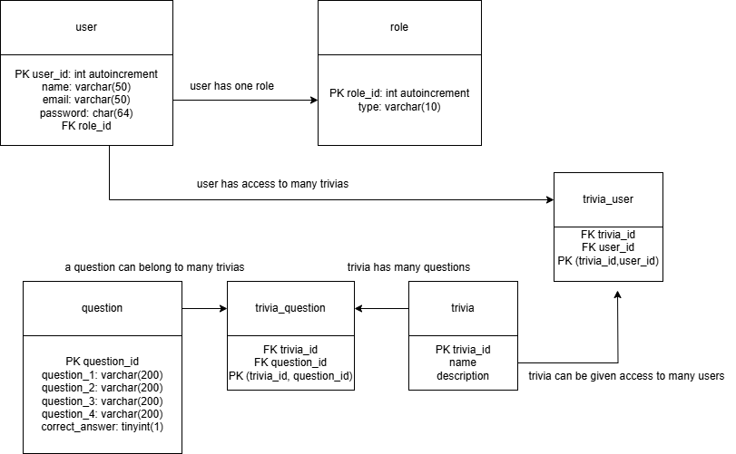
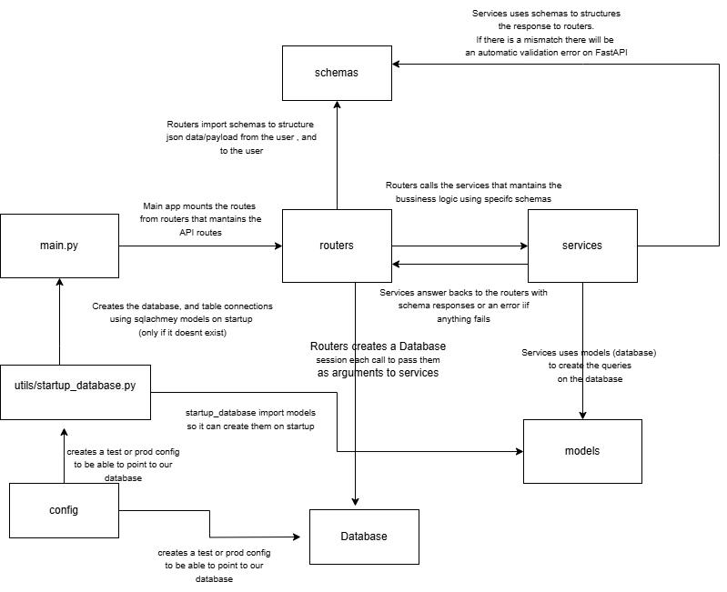

# TalaTrivia
TalaTrivia, an answer and question game for HR.

# Project description
The project uses FastAPI to be able to scale up in a much easier way than flask.
The project is separated in different folders:
- routers (used for mantaining API endpoints)
- services (used for mantaining business logic)
- models (used for mantaining database table)
- schemas (used for mantaining json paylods from user, and json responses to user)
- tests (used for testing on each commit via github workflow)
- config (used for handling user/password/port/ip of our database, and our API secret)
- database (used for database connection on routers, that are passed to services that modfies our business logic)
- utils (used to create our tables on startup, and for a custom made exceptions)

We use sqlachemy library to mantain our different models classes and tables

  
This is the overall structure of the API project.
```
├── test_env.env
├── main.py
├── config
│   └── settings.py
├── database
│   ├── database.py
├── models
│   ├── base.py
│   ├── question.py
│   ├── trivia.py
│   ├── trivia_question.py
│   ├── trivia_user.py
│   └── user.py
├── routers
│   ├── question.py
│   ├── trivia_participation.py
│   ├── trivia.py
│   └── user.py
├── schemas
│   ├── question.py
│   ├── trivia_participation.py
│   ├── trivia.py
│   ├── trivia_user.py
│   └── user.py
├── services
│   ├── __init__.py
│   ├── question.py
│   ├── trivia_participation.py
│   ├── trivia.py
│   └── user.py
├── tests
│   ├── __init__.py
│   ├── test_main.py
│   ├── test_question.py
│   ├── test_trivia_participation.py
│   ├── test_trivia.py
│   └── test_user.py
└── utils
    ├── exception.py
    └── startup_database.py
```

# Example calls on API


# Database Diagram



# API Diagram


