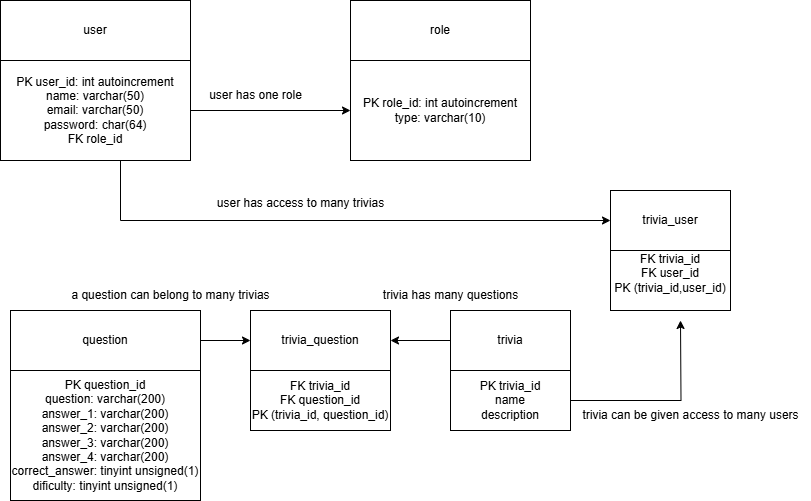
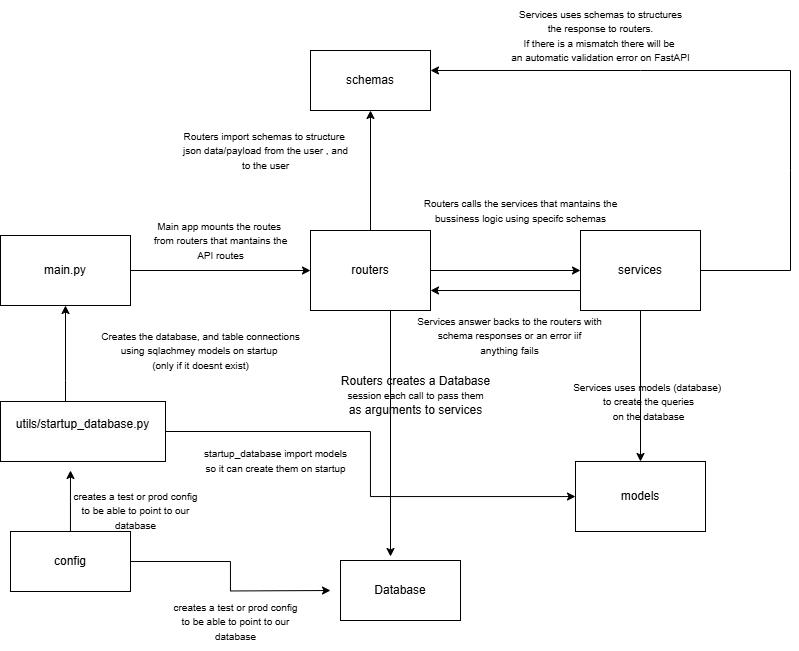

# TalaTrivia
TalaTrivia, an answer and question game for HR.

# Project startup

To start the project docker-compose is needed:
```
docker compose up -d --build
```
Mariadb must be fully started up for the api to be able to work.

This can be checked using: 
```
docker logs mariadb

2024-11-25 15:24:20 0 [Note] Plugin 'FEEDBACK' is disabled.
2024-11-25 15:24:20 0 [Note] Reading of all Master_info entries succeeded
2024-11-25 15:24:20 0 [Note] Added new Master_info '' to hash table
2024-11-25 15:24:20 0 [Note] mysqld: ready for connections.
```
It should say is ready for connections.

After that, we restart the API to make sure everything is connected:
```
docker restart talatrivia_api
```

Since we are exposing the port 8000 for the API, we can directly send requests:
```
curl -X POST http://0.0.0.0:8000/question/create/ \
     -H "Content-Type: application/json" \
     -d '{
       "question": "What is the chemical symbol for gold?",
       "answer_1": "Au",
       "answer_2": "Ag",
       "answer_3": "Hg",
       "answer_4": "Pb",
       "correct_answer": 1,
       "difficulty": 2
     }'
```
or if its preffered an python3 script
```
import requests
import json

# Define the URL and data
url = "http://0.0.0.0:8000/question/create/"
data = {
    "question": "What is the chemical symbol for gold?",
    "answer_1": "Au",
    "answer_2": "Ag",
    "answer_3": "Hg",
    "answer_4": "Pb",
    "correct_answer": 1,
    "difficulty": 2
}

response = requests.post(url, json=data)
print(response.json())

```
this should print back the response with an id, for example {'question_id': 14, 'answer_1': 'Au', 'answer_2': 'Ag', 'answer_3': 'Hg', 'answer_4': 'Pb', 'correct_answer': 1, 'difficulty': 2}


# Project description
The project uses FastAPI to be able to scale up in a much easier way than flask.
The project is separated in different folders:
- routers (used for mantaining API endpoints)
- services (used for mantaining business logic)
- models (used for mantaining database table)
- schemas (used for mantaining json paylods from user, and json responses to user)
- tests (used for testing on each commit via github workflow)
- config (used for handling user/password/port/ip of our database, and our API secret)
- database (used for database connection on routers, that are passed to services that modfies our business logic)
- utils (used to create our tables on startup, and for a custom made exceptions)

We use sqlachemy library to mantain our different models classes and tables

  
This is the overall structure of the API project.
```
├── test_env.env
├── main.py
├── config
│   └── settings.py
├── database
│   ├── database.py
├── models
│   ├── base.py
│   ├── question.py
│   ├── trivia.py
│   ├── trivia_question.py
│   ├── trivia_user.py
│   └── user.py
├── routers
│   ├── question.py
│   ├── trivia_participation.py
│   ├── trivia.py
│   └── user.py
├── schemas
│   ├── question.py
│   ├── trivia_participation.py
│   ├── trivia.py
│   └── user.py
├── services
│   ├── __init__.py
│   ├── question.py
│   ├── trivia_participation.py
│   ├── trivia.py
│   └── user.py
├── tests
│   ├── __init__.py
│   ├── test_main.py
│   ├── test_question.py
│   ├── test_trivia_participation.py
│   ├── test_trivia.py
│   └── test_user.py
└── utils
    ├── exception.py
    └── startup_database.py
```


routers/services/tests/schemas have all the same structure name , the name should reflect the functionality area (for example services/user, is all the bussniess logic involves user) , it doesn't use plurals.
The only thing that has plurals are the modules.

If we want to create another funcionality , in this case, user_ranking we would create:

- a schema, that has the structure when the user sends the json, and the structure for response
- a service, which is the bussniess logic, in this case, how we can show the user its ranking
- a router, which is where the endpoints are
- a test, for checking if the functionality is correct

It might need a model, but that is separated from our structure, since the models reflects our database diagram. 
  

# Database Diagram



# API Diagram




# TODO
- Make the API wait for mariadb to start. healthcheck were tried but they constantly were sending connections to mariadb , making the logs unreadable
- Make a cleanup for every test, there are a few that do a cleanup, but not all.
- Programming the ranking functionality, it's mostly done since it just need to list the data from trivia_user table, which should have the score if its answered
- Doing an automatic linting to follow pep8 codestyle. This should be done on github actions, so the linting check is automatic.
- Refactoring scripts that doesnt adhere to the overall code structure (for example services/trivia_participation.py has missing try/excepts , schemas name might need to be refactored so it make sense depending on the context, and so on)
  
  
